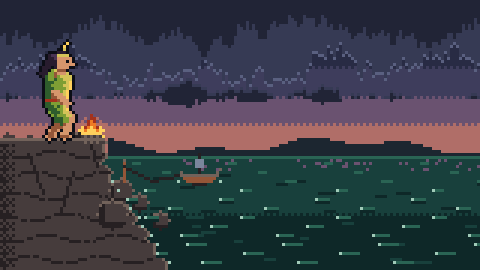
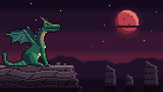
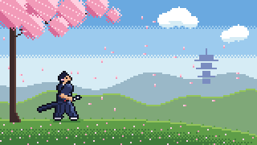
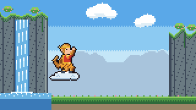
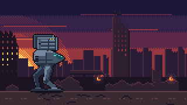
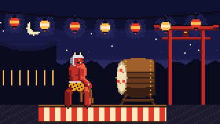
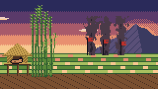

<div align="center">

<a href="https://pixel-anims.drisdev.io/showcase/lac-long-quan-sea-demon/"></a>

# pixel-anims

**One sentence in. A looping 16-bit sprite animation out.**

An <a href="https://agentskills.io/">Agent Skill</a> that writes a single self-contained HTML file:<br>vanilla JS and Canvas 2D, no assets, no libraries.

[](LICENSE)
[](#install)
[](#what-you-get)
[](#how-it-works)
[](#requirements)
[](https://pixel-anims.drisdev.io/)

[**Live showcase**](https://pixel-anims.drisdev.io/) · [Install](#install) · [Use](#use) · [How it works](#how-it-works)

</div>

## Showcase

Every piece below is one unedited HTML file written by the skill from a short brief. Click one to read its brief and watch it full screen.

<table>
  <tr>
    <td align="center" width="33%"><a href="https://pixel-anims.drisdev.io/showcase/dragon-fire-breath/"></a><br><sub><b>Red Moon Drake</b> · idle, inhale, breath, recover</sub></td>
    <td align="center" width="33%"><a href="https://pixel-anims.drisdev.io/showcase/samurai-quick-draw/"></a><br><sub><b>Sakura Iaido</b> · stance, slash, sheathe</sub></td>
    <td align="center" width="33%"><a href="https://pixel-anims.drisdev.io/showcase/monkey-king-staff-slam/"></a><br><sub><b>Monkey King Staff</b> · grow, twirl, slam, shrink</sub></td>
  </tr>
  <tr>
    <td align="center" width="33%"><a href="https://pixel-anims.drisdev.io/showcase/mech-missile-volley/"></a><br><sub><b>Ruin Walker Volley</b> · open pods, volley, impact</sub></td>
    <td align="center" width="33%"><a href="https://pixel-anims.drisdev.io/showcase/oni-taiko-drummer/"></a><br><sub><b>Oni Taiko Drummer</b> · three hits, a double, a shout</sub></td>
    <td align="center" width="33%"><a href="https://pixel-anims.drisdev.io/showcase/thanh-giong-ascension/"></a><br><sub><b>Thanh Giong Rises</b> · eight beats of a legend</sub></td>
  </tr>
</table>

<p align="center"><a href="https://pixel-anims.drisdev.io/showcase/"><b>See the full showcase →</b></a></p>

## Install

pixel-anims is an [Agent Skill](https://agentskills.io/): one folder with a `SKILL.md`, so any agent that reads the format can use it.

<details open>
<summary><b>Claude Code</b></summary>

```
/plugin marketplace add dris1153/pixel-anims
/plugin install pixel-anims@pixel-anims
```

Without the plugin system: `npx skills add dris1153/pixel-anims -a claude-code`.
</details>

<details>
<summary><b>Codex</b></summary>

Run in your project. It installs to `.agents/skills/`:

```
npx skills add dris1153/pixel-anims -a codex
```

For every project, copy the skill into `~/.agents/skills/` instead (see Manual).
</details>

<details>
<summary><b>OpenCode</b></summary>

Run in your project, or add `-g` to install for every project:

```
npx skills add dris1153/pixel-anims -a opencode
```

OpenCode also finds skills already in `~/.claude/skills` or `~/.agents/skills`.
</details>

<details>
<summary><b>Other agents</b>: Cursor, Gemini CLI, GitHub Copilot, Windsurf, Cline and 70+ more</summary>

Name your agent with `-a`, or leave it out to pick from a list. Add `-g` to install for every project.

```
npx skills add dris1153/pixel-anims -a cursor
```

See the [supported agents](https://github.com/vercel-labs/skills#supported-agents) of the `skills` CLI.
</details>

<details>
<summary><b>Manual</b></summary>

Copy the skill into your agent's skills folder: `~/.agents/skills` for Codex, OpenCode and most others, `~/.claude/skills` for Claude Code.

```
git clone https://github.com/dris1153/pixel-anims
mkdir -p ~/.agents/skills && cp -r pixel-anims/skills/pixel-anims ~/.agents/skills/
```
</details>

## Use

Describe the animation you want. The skill triggers on requests like these:

> Pixel art knight: idle, wind-up, sword slash with an arc trail and sparks, recover. Castle rampart at dusk.

> Pixel art dragon: idle breathing, inhale, fire-breath stream with embers, recover. Rocky cliff, red moon.

You can also invoke it directly:

| Agent | Invoke |
|---|---|
| Claude Code | `/pixel-anims:pixel-anims <brief>` after a plugin install, `/pixel-anims <brief>` otherwise |
| Codex | `$pixel-anims <brief>`, or pick it from `/skills` |
| OpenCode and others | Describe the animation; the agent loads the skill when the request matches |

## How it works

1. **Design note.** The agent plans the palette ramps, the states and their timings, the event tick and its effects, and where the light comes from.
2. **Scaffold.** A script copies the engine template. The engine handles the loop, integer scaling, particles, outlines and rim light, and it is never rewritten.
3. **Scene.** The agent writes only the scene: the backdrop, the character and the effects, drawn into palette-indexed buffers.
4. **Snapshot QA.** The page is rendered at chosen ticks to PNG in headless Chrome. The agent looks at the frames and fixes what it sees. The engine also checks that the last frame matches the first, so the loop has no seam.
5. **Deliver.** You get one `.html` file you can open anywhere.

What ships in the skill:

| File | Role |
|---|---|
| `SKILL.md` | The workflow, hard rules and engine contract the agent follows |
| `assets/wizard-spellcaster.html` | The engine, in a finished reference scene |
| `references/pixel-craft-rules.md` | Palette, silhouette, motion and FX rules for a 16-bit look |
| `scripts/new-scene.mjs` | Scaffolds a new page with the engine intact |
| `scripts/snapshot.mjs` | Renders ticks to PNG and reports errors and seam mismatches |

## What you get

- One `.html` file that loops a character through its action states.
- The look follows 16-bit rules: a fixed palette, integer scaling, a 60 Hz fixed timestep and pooled particles.
- The agent checks the result itself. It renders chosen ticks to PNG with `scripts/snapshot.mjs` and fixes what it sees. The engine also verifies that the loop seam is seamless.

## Requirements

Node 18 or newer and Chrome, Edge or Chromium for the snapshot QA step, and a model that can read images so the agent can review the PNGs.

## Website

The landing page and showcase live in `site/` as a plain Vite app. Run `pnpm install`, then `pnpm dev` to work on it or `pnpm build` to build `dist/`. To add a showcase, put its `.html` in `site/public/anims/`, add one entry to `site/src/showcases.js`, then run `pnpm posters <slug>`: it renders the tile placeholder (tick 0) and the 1200×630 link-preview thumbnail (the entry's `still` tick) into `site/public/posters/`. The build gives each showcase its own page at `/showcase/<slug>/` with its own title, description and thumbnail, plus `sitemap.xml`.

The site speaks English, Vietnamese, Korean, Japanese, Chinese, Thai, Hindi, Arabic and Spanish. Pick one with `?lang=<code>` or the globe button in the header; the choice is remembered. English lives in the HTML and `site/src/i18n/dict/en.js`; every other language is a file of `key: text` pairs in `site/src/i18n/dict/<code>.js`, and any missing key falls back to English. Showcase titles, tags and countries use the keys `title.<slug>`, `tag.<id>` and `country.<id>`. Everything except Vietnamese is a draft translation, and native fixes are welcome.

A showcase can also tell its story. Add `site/src/stories/<slug>/<code>.md`:

```markdown
---
origin: Vietnam · Legend of the Lê dynasty, 15th century
note: (optional) replaces the showcase note in this language
title: (optional) replaces the showcase title in this language
---

## legend

The tale, in plain paragraphs.

## beats

- lend: One line per state, keyed by the exact names in the showcase's `states`.
```

Both files and translations are optional. The detail page shows the story in the reader's language, or in English with a note when it has not been translated yet, and each beat seeks the preview to its state.

## License

[MIT](LICENSE). The country flags on the website are from [pixel-flags](https://github.com/tgines/pixel-flags) by Tony Gines, also MIT.
